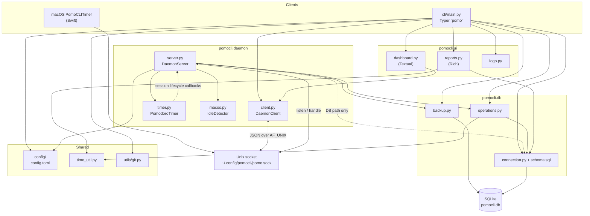

# pomocli

A lightweight, feature-rich CLI Pomodoro timer with git awareness, distraction tracking, and a live TUI dashboard.

## Installation

Requires Python 3.10+.

```bash
git clone https://github.com/EmadGohariTR/PomoCLI-time-tracker.git && cd PomoCLI-time-tracker
uv tool install .
```

Or install in development mode:

```bash
uv sync
```

## Quick Start

```bash
# 1. Initialize the database (first time only)
pomo init

# 2. Start a 25-minute session
pomo start "Write README" -p my-project

# 3. Check on your timer
pomo status

# 4. Done early? Stop and save
pomo stop
```

The background daemon starts automatically when you run `pomo start`; you do not need to launch it separately.

### Interactive mode

Run `pomo` with no arguments for the interactive command picker (arrow keys, fuzzy search).

Running `pomo start` without a task name opens interactive start: pick from recent tasks and projects, set duration and tags.

### Tips

- **Daemon:** You do not need to run the daemon manually; `pomo start` starts it when needed.
- **Last task:** `pomo start --last` (or `-l`) resumes the most recently used task.
- **Tags:** `pomo start "Task" -t focus -t deep-work` attaches tags to the session (stored for each session; useful for your own records and interactive tag hints).
- **Distractions:** `pomo distract` with an optional description. Each distraction can extend the timer by a configured number of minutes (default: 2).
- **Lifecycle events:** Session events (`start`, `pause`, `resume`, `extend`, `stop`, `kill`, `idle`, `complete`) are logged for later analysis.
- **Git:** Current repo and branch are saved with each session when you are inside a git working tree.
- **Config:** `pomo config` edits defaults; settings live in `~/.config/pomocli/config.toml`.
- **Interactive cancel:** Use `Ctrl-C` to cleanly exit interactive picker/start/config flows.
- **Reports:** `pomo report today` (or `week`, `month`, `quarter`, `all`) uses your configured **timezone** for “today” and calendar periods (see [Configuration](#configuration)).

## Commands

| Command | Shorthand | Description |
|---------|-----------|-------------|
| `pomo` | | Interactive command picker |
| `pomo start [TASK]` | `ss` | Start a Pomodoro session |
| `pomo pause` | `pp` | Pause the current session |
| `pomo resume` | `rr` | Resume a paused session |
| `pomo stop` | `sp` | Stop and save the current session |
| `pomo kill` | | Abort session without marking completed |
| `pomo distract [DESC]` | `dd` | Log a distraction |
| `pomo extend` | `ee` | Extend the current session (configured minutes) |
| `pomo status` | `stt` | Show timer status |
| `pomo list` | | List today's sessions with status, focus rate, and notes |
| `pomo report [PERIOD]` | | Summary report: `today`, `week`, `month`, `quarter`, or `all` |
| `pomo backup` | | Create a manual database backup |
| `pomo dash` | | Live TUI dashboard (`--detail minimal`, `normal`, or `full`) |
| `pomo logo` | | Print the CLI logo |
| `pomo config` | | Interactive configuration |
| `pomo init` | | Create or reinitialize the database |

Use `-h` or `--help` on any command for options.

### Shell completion

```bash
pomo --show-completion
```

Follow the printed instructions for bash, zsh, fish, or PowerShell.

### `pomo start` options

```
pomo start "Task name" [OPTIONS]

Options:
  -p, --project TEXT      Project name
  -d, --duration INTEGER  Duration in minutes (default: 25)
  -e, --estimate INTEGER  Estimated total minutes for the task
  -l, --last              Resume the last task
  -t, --tag TEXT          Tags (repeatable)
```

## Configuration

Run `pomo config` interactively, or edit `~/.config/pomocli/config.toml`.

| Setting | Default | Description |
|---------|---------|-------------|
| `session_duration` | 25 | Pomodoro length (minutes) |
| `break_duration` | 5 | Break length (minutes) |
| `idle_timeout` | 300 | Seconds idle before auto-pause (macOS, with status bar app) |
| `sound_enabled` | true | Sound notifications |
| `history_retention_days` | 30 | How far back recent tasks/projects are shown in interactive start |
| `hotkey_distraction` | `cmd+shift+d` | Global distraction hotkey (macOS app) |
| `distraction_extend_minutes` | 2 | Minutes added per distraction (`0` to disable) |
| `timezone` | `auto` | Display and calendar semantics for reports and retention: `auto` uses system local time, or set an IANA name (e.g. `Europe/Berlin`) |
| `backup_interval_days` | 0 | Minimum days between automatic backups (`0` to disable) |
| `backup_max_versions` | 7 | Maximum backup files to keep |
| `backup_dir` | `""` | Directory for backups (empty uses `~/.config/pomocli/backups`) |
| `backup_compress` | true | Gzip backups (`.db.gz`) to save space |

**Time storage:** Session and task timestamps are stored in **UTC** in the database. Reports and “last N days” history use the effective timezone above so “today” and trend buckets match your local calendar.

## Data storage

Everything under `~/.config/pomocli/`:

| Path | Purpose |
|------|---------|
| `pomocli.db` | SQLite: tasks, sessions, tags, distractions |
| `config.toml` | User preferences |
| `backups/` | Default directory for automatic and manual backups |

Override the database location for backups or demos:

```bash
export POMOCLI_DB_PATH=/path/to/custom.db
pomo report week
```

### Database backups

Pomocli can automatically back up your database using the SQLite backup API (ensuring consistency even while the timer runs).

- **Automatic:** Set `backup_interval_days` > 0 in `pomo config`. The daemon will check periodically and create a backup if the interval has passed.
- **Manual:** Run `pomo backup` at any time (or via cron).
- **Compression:** Backups are gzipped by default (`.db.gz`). To restore, just unzip it: `gunzip -c pomocli-YYYYMMDD-HHMMSS.db.gz > restored.db`.
- **Rotation:** Old backups are automatically deleted so only the newest `backup_max_versions` remain.

## macOS status bar app

**PomoCLI Timer** is a small Swift app: menu-bar countdown, global distraction hotkey, and idle detection—without Python or Accessibility permissions for those features.

### Build and install

Requires Xcode Command Line Tools (`xcode-select --install`).

```bash
cd macos/PomoCLITimer
make install    # build, bundle, copy to ~/Applications/
```

After install, `pomo start` can auto-launch the app; you can also open it manually or add it to Login Items.

### Features

- **Menu bar** — idle `🍅`; running `🍅 MM:SS`; paused `⏸ MM:SS`
- **Menu** — Pause / Resume, Stop, Quit
- **Global hotkey** — default Cmd+Shift+D (`hotkey_distraction` in config)
- **Idle detection** — auto-pause when away (Quartz-based)

Global hotkeys and menu-bar integration are provided by the Swift app only; the Python daemon does not register global hotkeys.

## Development

```bash
uv sync
uv run pytest
```

### Demo / test database

`scripts/seed_test_db.py` fills a database with varied tasks, sessions (completed, stopped, killed), tags, distractions, and git fields—useful for reports and the dashboard.

**Always set `POMOCLI_DB_PATH`** so you do not overwrite your real database:

```bash
POMOCLI_DB_PATH=./demo.db uv run python scripts/seed_test_db.py
POMOCLI_DB_PATH=./demo.db uv run pomo report week
POMOCLI_DB_PATH=./demo.db uv run pomo dash
```

The script prints a reminder if `POMOCLI_DB_PATH` is unset.


Component diagram for the app:


